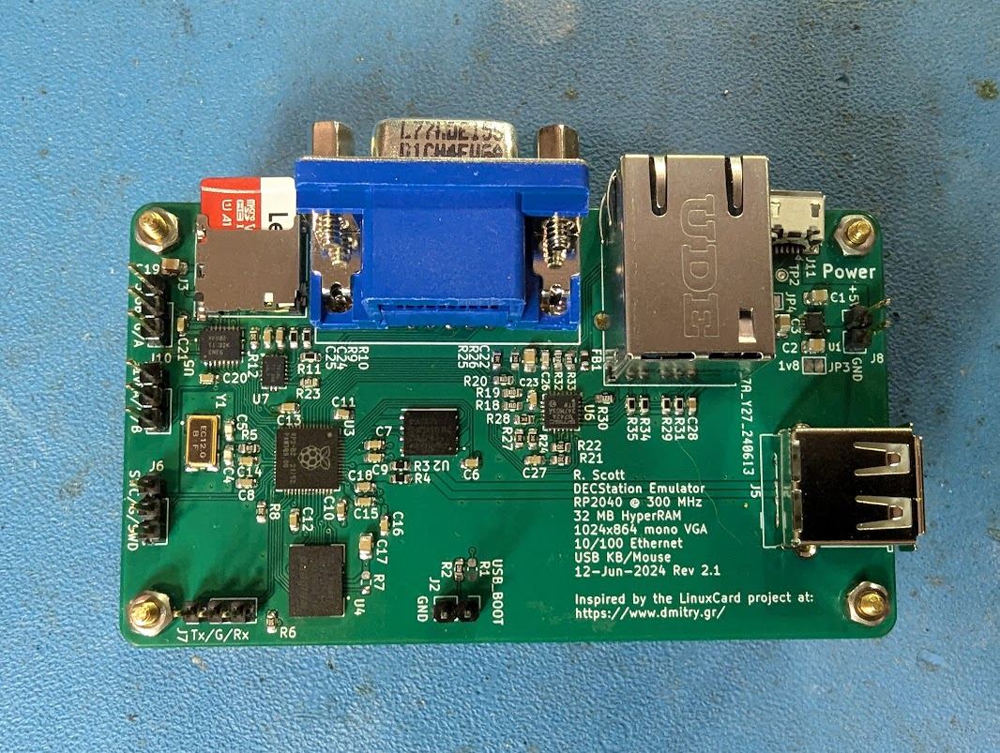
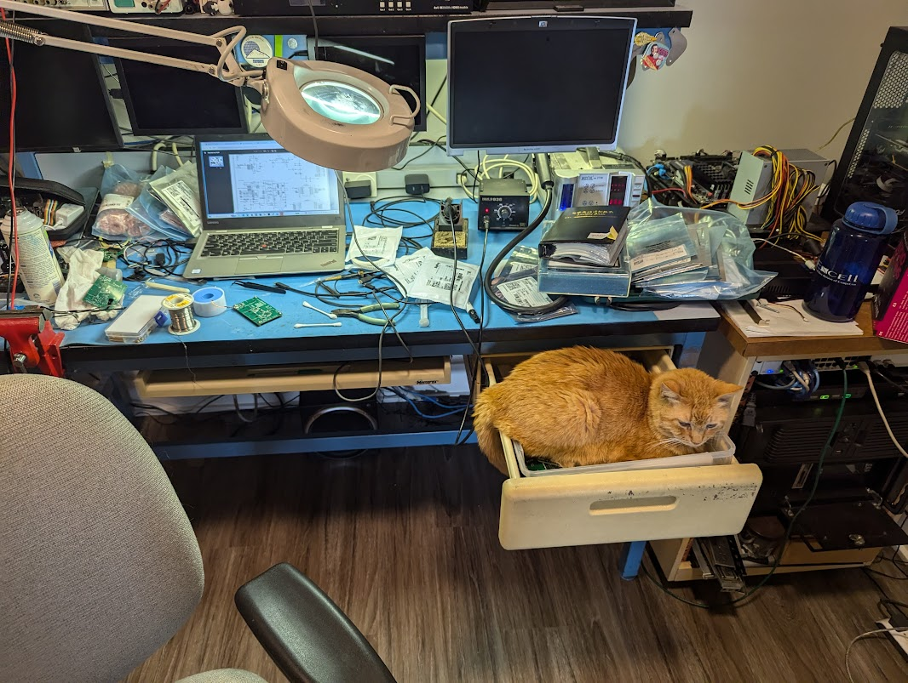

#DECstation 2040

##1.0) Introduction

This document outlines the DECstation 2040, a RP2040 based DECstation 3000
emulator that can run DECWindows. A summary of features:

Hardware:

- RP2040, running at 1.8v/300 MHz
- 32 MB of PSRAM
- 8 MB SPI flash
- uSD card socket
- Monochrome VGA at 1024 x 864
- Ethernet RMII PHY support (socket on rev 1.5, integrated in rev 2.1)

Software:

- 4 port PSRAM PIO engine
- PIO driven VGA, with seperate 16x16 cursor plane overlay
- USB HID to DECWindows keyboard and mouse
  
##1.1) Software 

###PIO:
The PSRAM/HyperRAM PIO engine provides 42/32 MB/s (write/read) of memory
bandwidth. Further, four PIO engines are used to provide four seperate
read/write memory ports. This allows independent memory access for
the emulated CPU, video DMA, and receive/send Ethernet traffic. Note that
all 32 instruction slots are used.

The video PIO engine can support up to a sysclk/2 pixel rate. Thus,
for the 300 MHz sysclk typically used, it is possible to run 1080p60 at
a pixel rate of 148.5 MHz. The default video rate is 1024 x 768 @ 70Hz,
as this matches the screen used for development and the pixel rate
is an integral divisor from sysclk. Only five PIO instruction slots are
used.

###DMA:
To drive the video PIO engine, five DMA channels are used. They are allocated
as follows:

- ctrl_dma_chan - points to DMA channel command packets
- data_dma_chan - executes DMA command packets
- ps_read_chan - points to PSRAM read data buffer
- inc_dma_chan - used to generate loop counter indices
- cur_inc_dma_chan - used as cursor loop counter

We use the RP2040 DMA sniffer to dynamically generate PSRAM addresses. This
eliminates the need to have a per-line PSRAM command packet. Further,
we use the inc_dma_chan to enable DMA command loops, so the we can
further eliminate per-line DMA commands needed to send commands to
the PIO pixel and PSRAM PIO engines. This makes the amount of memory
needed to drive video independent of the display format. Currently,
86 DMA command packets are used vs. approximately 2250 required for 1080p.

In order to eliminate the latency from when the PSRAM PIO engine FIFO
has read data, and it's delivery to SRAM, we use the ps_read_chan. This
channel is chained to after a PSRAM DMA command is executed. Without
this channel, the PSRAM PIO engine FIFO would be not be emptied until
the next DMA command is executed. This impacts the non-video PSRAM
channels, as they must wait unitl the video PSRAM command is complete.

###USB:
The USB HID code supports (at least) two keyboard/mouse combo types:
Rii mini X1 (model: RT-MWK01), purchased at MicroCenter, and Logitech
K830. 

###Emulator:
Dmitry's code at http://dmitry.gr/?r=05.Projects&proj=33.%20LinuxCard was
modified to support the RP2040, as well as adding support for video and USB
mouse/keyboard input. With overclocking and running the assembly language
version of the CPU emulator, Dmitry's Linux image reports a BOGOMIPS rating
of 13.44.

#2.0) Getting started

##2.1) Hardware
Build either rev 1.5 or 2.1, using the appropriate emu_brd directory. Please
note that rev 2.1 is still undergoing Ethernet debug, and has exhibited
significant packet drops. I use JLCPCB for board fabrication, and there are 
Digikey BOM spreadsheets in doc/bom. Recommend building two boards: one to
use as a 1.8v CMSIS debugger, and the other as the target. Feel free only
populate the RP2040 related components on the CMSIS debugger.

The surface mount parts aren't too troublesome - I find the PSRAM BGA to be
much easier to solder than the RP2040 QFN. My technique is to use a hot-air
SMT rework tool. Recommended assembly steps:
1) Solder the voltage regulator, check for 1.8v and 3.3v when done.
2) Solder all of the passives, the RP2040, flash, and the USB connectors
if building rev 2.1. (Note that two bodge wires are needed to connect J5
and J11 D+/D- as my assumption that USB-A could serve as non-host connector
was incorrect).
When done, use blink_bringup (below) to check connections. (Edit blink.c
to enable the pins to check).
3) Solder the HyperRAM chip, run mem_test to check connections.
4) Solder the voltage translator chips, edit blink.c and run to check
connections.
5) Solder the connectors.

For rev 1.5:
Needs modified waveshare LAN8722 board. In addition to the modifications
outlined at: https://github.com/maximeborges/pico-rmii-ethernet, pin 13 of
the 7 x 2 connector (originally NC) is used as VDDIO for the LAN8722 chip.
To make this modification, cut the existing connection between LAN8722 pin
9 to 3.3v, and route pin 9 to pin 13 of the connector. This allows the use
of 1.8v I/O from the DECstation 2040 board. Also needed is a 6 pin header
to VGA connector. See rev 2.1 schematic for VGA pins needed.

##2.2) Software
Start with:
http://dmitry.gr/?r=05.Projects&proj=33.%20LinuxCard
Download the images, particularly the ultrix.gui image. This should be placed
on a FAT32 for uMIPS. Edit uc_main.c to select which image to run.

Next, go to where this README.md is stored. Then set current directory to sw.
Edit the "source_this" file to reflect the location of the Pico SDK, and source
this file to set the PICO_SDK environment variable for the current session.

A good place to start is with the blink_bringup directory. CD to this,
and do:

`cmake -B build -S .`

Build software via

`./build.sh`

This will generate an .elf file in build/src. Use picotool to load this onto
the target board. After rebooting, should get "hello, world" on USB serial, as
well as on the hardware serial port. A 500 Hz square wave should be present
on GPIO21 (ret_clk). This can be changed via editing the src/blink.c file.
I use this tool incrementally while soldering the board, to verify connectivity.

Next, build the CMSIS debugger. CD to the picoprobe directory and
build with:

`cmake -B build -DCUSTOMPROBE=1
make -C build`

Program with

`sudo picotool load build/customprobe.elf`

Now go to the psram directory and do:

`cmake -B build -S .`

Build software via

`./build.sh`

This will generate most of the available packages. Of interest are:

- mem_test - a simple memory tester
- fb_test - test program for the frame buffer library
- fb_mem_test - memory test with frame buffer enabled
- pico-rv32ima - RISC-V linux emulation
- uMIPS - DECstation emulation
- pico_rmii_ethernet_httpd - test program for RMII. 

There are shell scripts to load the above:

- cl_sram.sh   - sd command line
- eth_sram.sh  - ethernet test
- fb_flash.sh  - framebuffer library test, run from flash
- fb_sram.sh   - framebuffer library test, run from SRAM
- fbm_flash.sh - memory test with framebuffer enabled, run from flash
- fbm_sram.sh  - memory test with framebuffer enabled, run from SRAM
- mt_sram.sh   - memory test, run from SRAM
- mt_flash.sh  - memory test, run from flash
- um_flash.sh - uMIPS emulator, run from flash
- um_sram.sh  - uMIPS emulator, run from SRAM

Running the code:
Connect the debugger board to the SWD port on the target.
Start the CMSIS debugger via sw/start_cmsis.sh.
Execute one of the scripts above. This will load the program into RP2040
SRAM and start it.

If you wish to run from flash, comment out the no_flash line in the source CMakeLists.txt. Note that the uMIPS emulator requires "copy_to_ram" to be enabled
when running from flash.

#3.0) Commentary

This project has been a voyage of discovery. The first doc/build_log.txt entry
was on 23-mar-2023, but I'd been thinking of building a business card
ever since I'd read Dmitry's LinuxCard web page. I've learned how to
use the RP2040 PIO engines and the DMA subsystem to push pixels. I'm
amazed at how flexible and capable the RP2040 has turned out to be. Hats off
to the RP2040 designers! 

Most enjoyable moments:

- When the PSRAM PIO engine finally ran the memory test overnight.
- When the second solution to the problem of how to get the DMA subsytem
to do a counted loop actually worked without killing SD card access.
- When the DMA cursor read data during blanking worked, giving smooth
cursor movement.

Less than enjoyable moments:

- Realizing the "optimization" of reordering data on the PSRAM to improve
layout was wrong, after submitting the design to JLCPCB.
-  Realizing that the first flash part chosen didn't support "Continuous Read
Mode". On the other hand, this did force me to learn how to do SRAM builds,
speeding up development.
- Having the wrong footprint for the level translator on rev 1.3.
- Finding out that Digikey no longer stocked the Ethernet connector on
rev 2.0, after submitting PCB. Related - the PSRAM was out of stock, so
clicked on the recommended alternative. Was disappointed when the box
showed up, and it was the waferscale part. Tiny, but unsolderable.

#4.0) Next steps
- Use the ps_get_buf DMA subroutine to setup the cursor PSRAM command. This
will reduce the memory footprint.
- Write the lance Ethernet emulation code for uMIPS.
- Port MicroMac https://axio.ms/projects/2024/06/16/MicroMac.html

#5.0) Acknowledgements

This project would not exist without Dmitry's excellent LinuxCard project,
at: http://dmitry.gr/?r=05.Projects&proj=33.%20LinuxCard

Inspiration and software framework:
https://github.com/Wren6991/PicoDVI.git

DEC mouse and keyboard support used code from:
https://hackaday.io/project/19576-dec-mouse-adapter and 
https://github.com/pkoning2/lk201emu.git

Ethernet:
https://github.com/maximeborges/pico-rmii-ethernet

Also, Hackaday.com for articles on SMT soldering, USB-C, etc., giving me
confidence that I could actually do this project!

## Pictures/video
A selection of pictures from doc/photos follows. See doc/photos for pictures
of previous versions and how the emulated video output progressed from first
pixel to current.
###Video showing [Xmaze/worms](https://youtu.be/O6Lyjsey6ek) running
###
Rev 1.5
###
Rev 1.5 running
###
Rev 2.1
###
Rev 2.1 running
###
Helper cat in the parts box
